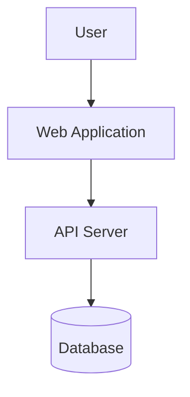

# Architecture Documentation

This directory holds the system architecture documentation. As the project grows, add diagrams, decision records, and rationales here.

## Structure

```
docs/architecture/
├── README.md              # This file — overview and index
├── system-context.md      # C4 Level 1: System context diagram
├── containers.md          # C4 Level 2: Container diagram
├── components/            # C4 Level 3: Component diagrams per container
└── decisions/             # Cross-cutting architecture notes (ADRs in docs/adr/)
```

## C4 Model Approach

This project uses the [C4 model](https://c4model.com/) for visualising architecture:

1. **System Context** — Who are the users and external systems?
2. **Container** — What are the high-level technology units (web app, API, database)?
3. **Component** — What are the internal components within each container?
4. **Code** — Detail-level class/interface diagrams (used sparingly)

## When to document architecture

- A new container or component is added.
- A significant dependency or integration is introduced.
- An existing architecture decision is revisited or superseded.
- A new contributor needs to understand the system.

## Diagrams

Prefer Mermaid diagrams (`.mmd` files or inline in markdown) for version-controllable architecture diagrams. Example:



## References

- [ADR Log](../adr/README.md) — Architecture Decision Records
- [Tech Stack](../../PROJECT.md) — Technology choices
- [API Docs](../api/) — API contracts
