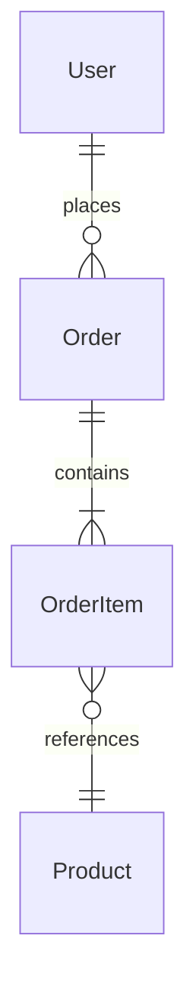

# Database Documentation

This directory contains database schema definitions, migration guides, and data model documentation.

## Structure

```
docs/database/
├── README.md              # This file — overview and conventions
├── schema/                # Entity-Relationship diagrams and schema docs
├── migrations/            # Migration guides and changelog
└── queries/               # Complex or notable query documentation
```

## Conventions

- **Migrations are code.** Database changes are version-controlled alongside application code.
- **Every change is reversible.** Each migration must have a corresponding rollback.
- **Document the model, not the SQL.** Keep schema docs focused on entities, relationships, and constraints.
- **Naming.** Tables are plural snake_case (`orders`, `order_line_items`). Columns are singular snake_case (`created_at`, `customer_id`).

## Entity-Relationship Diagrams

Prefer Mermaid for ERDs:



## Migration Guide

| Version | Description | Date | Status |
|---------|-------------|------|--------|
| — | *No migrations created yet.* | | |

## Entities

### Transaction

Bảng ghi nhận giao dịch thanh toán qua QR chuyển khoản thủ công (UC-26).

| Column | Type | Description |
|--------|------|-------------|
| `id` | BIGINT (PK) | ID tự tăng |
| `registration_id` | BIGINT (FK) | FK → registrations.id |
| `amount` | DECIMAL(10,2) | Số tiền thanh toán |
| `payment_method` | ENUM('BANK_TRANSFER') | Phương thức thanh toán |
| `status` | ENUM('PENDING_CONFIRMATION', 'SUCCESS', 'FAILED') | Trạng thái giao dịch |
| `created_at` | DATETIME | Thời điểm tạo |
| `paid_at` | DATETIME NULL | Thời điểm Student báo đã thanh toán |
| `confirmed_at` | DATETIME NULL | Thời điểm Admin xác nhận |
| `confirmed_by` | BIGINT NULL (FK) | FK → users.id (Admin xác nhận) |

**Lưu ý:** Thanh toán thực hiện qua QR chuyển khoản thủ công, không qua cổng thanh toán bên thứ ba.

## Seed Data

## References

- [API Docs](../api/) — How data flows through the API
- [Architecture](../architecture/) — System context
