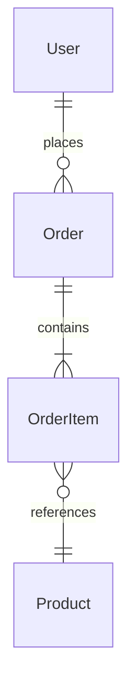

# Database Documentation

This directory contains database schema definitions, migration guides, and data model documentation.

## Structure

```
docs/database/
├── README.md              # This file — overview and conventions
├── schema/                # Entity-Relationship diagrams and schema docs
├── migrations/            # Migration guides and changelog
└── queries/               # Complex or notable query documentation
```

## Conventions

- **Migrations are code.** Database changes are version-controlled alongside application code.
- **Every change is reversible.** Each migration must have a corresponding rollback.
- **Document the model, not the SQL.** Keep schema docs focused on entities, relationships, and constraints.
- **Naming.** Tables are plural snake_case (`orders`, `order_line_items`). Columns are singular snake_case (`created_at`, `customer_id`).

## Entity-Relationship Diagrams

Prefer Mermaid for ERDs:



## Migration Guide

| Version | Description | Date | Status |
|---------|-------------|------|--------|
| — | *No migrations created yet.* | | |

## Seed Data

*Describe how seed/fixture data is managed here.*

## References

- [API Docs](../api/) — How data flows through the API
- [Architecture](../architecture/) — System context
